# Recipebook

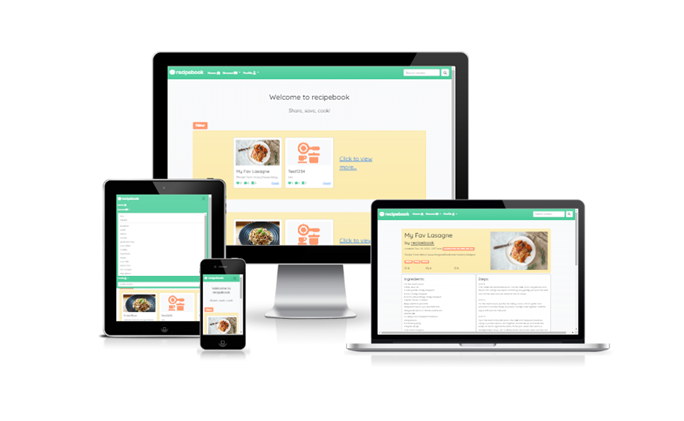

- Recipebook is a social recipe website which combines the functionality of social media with the practicality of a recipe hosting site. Users can sign-up to share their own recipes, save and like other's, and interact with each other through commenting.   

## Links

[Link to the live project hosted on Heroku (right click to open in new tab)](https://pp4-recipebook.herokuapp.com/)

[Link to the project repository hosted on Github (right click to open in new tab)](https://github.com/BeckySkel/fullstack-project-4)

---
## Table of Contents
- [Strategy](https://github.com/BeckySkel/fullstack-project-4/blob/main/README.md#strategy)
    - [Target Audience](https://github.com/BeckySkel/fullstack-project-4/blob/main/README.md#target-audience)
    - [User Stories](https://github.com/BeckySkel/fullstack-project-4/blob/main/README.md#user-stories)
- [Scope](https://github.com/BeckySkel/fullstack-project-4/blob/main/README.md#scope)
    - [Research](https://github.com/BeckySkel/fullstack-project-4/blob/main/README.md#research)
    - [Future Features](https://github.com/BeckySkel/fullstack-project-4/blob/main/README.md#future-features)
    - [Testing](https://github.com/BeckySkel/fullstack-project-4/blob/main/README.md#testing)
- [Structure](https://github.com/BeckySkel/fullstack-project-4/blob/main/README.md#structure)
    - [Wireframes](https://github.com/BeckySkel/fullstack-project-4/blob/main/README.md#wireframes)
    - [Information Architecture](https://github.com/BeckySkel/fullstack-project-4/blob/main/README.md#information-architecture)
- [Skeleton](https://github.com/BeckySkel/fullstack-project-4/blob/main/README.md#skeleton)
    - [Current Features](https://github.com/BeckySkel/fullstack-project-4/blob/main/README.md#current-features)
    - [Technologies Used](https://github.com/BeckySkel/fullstack-project-4/blob/main/README.md#technologies-used)
- [Surface](https://github.com/BeckySkel/fullstack-project-4/blob/main/README.md#surface)
    - [Design](https://github.com/BeckySkel/fullstack-project-4/blob/main/README.md#design)
    - [Deployment](https://github.com/BeckySkel/fullstack-project-4/blob/main/README.md#deployment)
- [Credits](https://github.com/BeckySkel/fullstack-project-4/blob/main/README.md#credits)
    - [Content](https://github.com/BeckySkel/fullstack-project-4/blob/main/README.md#content)
    - [Media](https://github.com/BeckySkel/fullstack-project-4/blob/main/README.md#media)
    - [Acknowledgemnets](https://github.com/BeckySkel/fullstack-project-4/blob/main/README.md#acknowledgements)

---
## Strategy

### Target Audience
- This site is targeted towards anyone who enjoys cooking - beginner or advanced - who would like to either share their own recipes with others or search for some new ones to try.

- View [User Personas](documents/personas.pdf)

### User Stories

#### Admin
*These are staff/admin users who maintain the site and manage it's contents.*
- [#1](https://github.com/BeckySkel/fullstack-project-4/issues/1) As an admin, I can edit and remove recipes so that I can manage the site contents.
- [#2](https://github.com/BeckySkel/fullstack-project-4/issues/2) As an admin, I can read and remove comments so that inappropriate comments can be removed.

#### Recipe Sharers
*These are users who intend to share recipes on the platform.*
- [#3](https://github.com/BeckySkel/fullstack-project-4/issues/3) As a recipe sharer, I can post my own recipes so that I can share them with others.
- [#4](https://github.com/BeckySkel/fullstack-project-4/issues/4) As a recipe sharer, I can set my posted recipes to private or public so that I can control who views them.
- [#5](https://github.com/BeckySkel/fullstack-project-4/issues/5) As a recipe sharer, I can edit my posted recipes so that I can update any mistakes/changes.
- [#6](https://github.com/BeckySkel/fullstack-project-4/issues/6) As a **user**, I can create an account so that I can interact with other users content and create my own.
- [#8](https://github.com/BeckySkel/fullstack-project-4/issues/8) As a **user**, I can categorise my posted/saved recipes so that I can find them more easily in the future.
- [#11](https://github.com/BeckySkel/fullstack-project-4/issues/11) As a **user**, I can attach notes to my saved recipes so that I can view them later and make my own adjustments.
- [#12](https://github.com/BeckySkel/fullstack-project-4/issues/12) As a recipe sharer, I can add tags to my recipes so that they are more visible to others.

#### Recipe Viewers
*These are users who intend to view recipes that others have posted.*
- [#6](https://github.com/BeckySkel/fullstack-project-4/issues/6) As a **user**, I can create an account so that I can interact with other users content and create my own.
- [#7](https://github.com/BeckySkel/fullstack-project-4/issues/7) As a recipe viewer, I can save recipes to my library so that I can access them again later.
- [#8](https://github.com/BeckySkel/fullstack-project-4/issues/8) As a **user**, I can categorise my posted/saved recipes so that I can find them more easily in the future.
- [#9](https://github.com/BeckySkel/fullstack-project-4/issues/9) As a recipe viewer, I can like and comment on other's recipes so that I can share my opinion.
- [#10](https://github.com/BeckySkel/fullstack-project-4/issues/10) As a recipe viewer, I can search for recipes so that I can find one that matches what I'm looking for.
- [#11](https://github.com/BeckySkel/fullstack-project-4/issues/11) As a **user**, I can attach notes to my saved recipes so that I can view them later and make my own adjustments.
- [#13](https://github.com/BeckySkel/fullstack-project-4/issues/13) As a recipe viewer, I can view the nutritional information of a recipe so that I can make an informed decision based on my dietary needs.
- [#14](https://github.com/BeckySkel/fullstack-project-4/issues/14) As a recipe viewer, I can view the recipe difficulty so that I can select a recipe which would suit my skill set.
- [#15](https://github.com/BeckySkel/fullstack-project-4/issues/15) As a recipe viewer, I can view the time requirements for the recipe so that I can select a recipe based on the time it takes to prepare.
- [#16](https://github.com/BeckySkel/fullstack-project-4/issues/16) As a recipe viewer, I can create a printable shopping list from the ingredients list so that I can purchase the necessary ingredients to try the recipe.
- [#17](https://github.com/BeckySkel/fullstack-project-4/issues/17) As a recipe viewer, I can increment the required servings so that it can serve more or less people.

---
## Scope

### Research
- Before any planning, I conducted research into both social media and recipes websites and took note of the conventional layouts and formats as well as which features I thought enhanced the user's experience and would be good to include for my target audience(s).

### Future Features

#### Categorising Recipes
- In the future, I'd like to give the users an option to file their saved recipes into different categorised folders. This would involve adding a "New Folder" form where user's could create their own categories and a drop down on the save buton where users could select the folder/category they'd like to save the recipe to. These folders and their contents would then be available from the user's dashboard.

#### Nutritional Info
- Another helpful feature would be to add nutritional information to the recipes. This would either be an input from the recipe poster or, to make it more efficient and accurate, a connection to a nutrition API. The ingredients input would have to be changed to seperate the ingredients into their own inputs so that the API could be called based on the value.

#### Difficulty
- Either inputted by the poster at time of creation or voted on by the community (or both), the recipe could be assigned a difficulty (beginner, intermediate or pro) so that user's can select based on their current abilities. There is currently already a 'Quick & Easy' tag so this could be extended to include other difficulty tags.

#### Time Requirements
- Similarly to difficulty, the time requirememnts (prep and cook times) could be added to the recipe so that users can select based on their available time. Could be input by poster and/or voted on by community.

#### Shopping List
- A shopping list feature could be added to combine ingredients from multiple recipes into 1 printable list to save times for the user.

#### Required Servings
- Adding a counter to increment the required portions and thus adjusting the ingredient amounts. Similarly to the nutritional info, this would require splitting the ingredients into their own inputs and seperate amounts to make the mathematical adjustments possible. 

### Testing
- Throughout the project, I relied heavily on [Chrome Devtools](https://developer.chrome.com/docs/devtools/) to help me view this project on different screen sizes so that I could adjust elements, create media queries (by adding bootstrap classes) for responsive design and debug JavaScript by logging outcomes to the console.
- Code was also run through validators and automatic tests were run through Django
- Please follow [this link](documents/TESTING.md) for full list of tests carried out on this website

---
## Structure

### Wireframes
- After looking at common designs and features and deciding what I would like to include, I mapped out the intended features of the website using [Balsamiq](https://balsamiq.com/) to create wireframes of some of the page views.
- [View the wireframes here](documents/wireframes.pdf)
- The key differences between planning and the final product are presentation of the nav bar and the forms.

### Information architecture
- Recipebook is a blog-style site with multiple pages which relies on the MVC framework: Django to present information from a recipe database and provide CRUD functionality.
- Recipes are presented as cards whilst browsing and full page views when viewing. the cards link to the recipe viewer.
- Recipes can be browsed using tags or searching in the search bar in the top right of the navbar.
- The home page displays 2 carousels with recipe cards for the newest and most popular recipes with a 'View more...' link on the last card (maximum 9 cards).
- All pages are responsive thanks to bootstrap classes.
- Browsing/search results pages present the related recipes in a large flex container.
- Profile pages can be viewed by either clicking the author/username at the top of the recipe detail page or selecting Dashboard from the Profile dropdown menu in the navbar (this will show your own profile if logged in).

### Data model

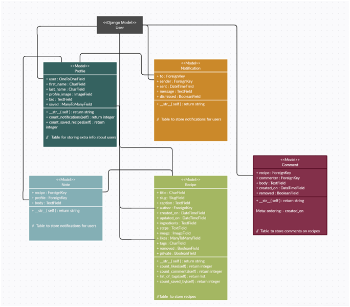

---
## Skeleton

### Current Features

#### Header & Navbar
- Sticky
- Logo to the left with 3 navigation buttons: Home button, Browse dropdown and Profile dropdown. When reduced to small screens, logo stay left while navigation hidden in collapsible menu.
- Browse dropdown hosts links to browse recipes by tag
- Profile dropdown hosts links to interact with user's profile options whilst logged in or to login/register when logged out
- Search bar input which leads to search results page when submitted

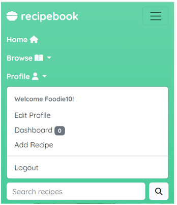

#### Footer
- Copyright on left
- External links to social medias on right

#### Homepage
- Welcomes user and displays either 2 carousels (new & popular recipes) or 2 side-scrollers depending on screen size
##### Carousels
- Up to 3 'pages' with 3 cards on (final card is link to view more). Less if not enough recipes on the site. Displayed on larger screens.

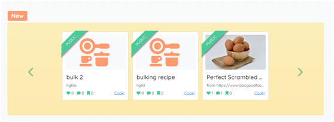
##### Scrollers
- Cards displayed inline and up to 9 (final card is link to view more). Displayed on smaller screens and user can swipe to scroll.

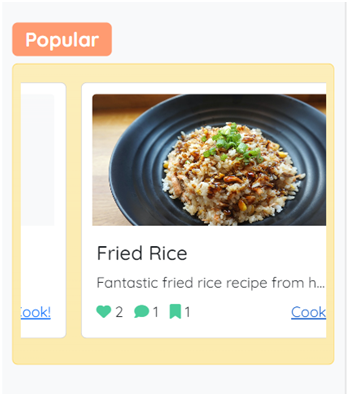

#### Browse & Search
- Displays all matching recipes as cards in grid view.

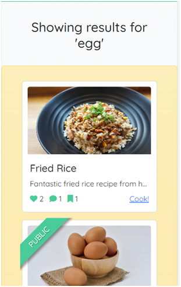

##### Cards
- Compact view of recipe key features.
- Displays recipe image, title, caption, likes counter, comments counter and saves counter as well as a stretched link.
- If recipe belongs to the user currently logged in, a banner is displayed which lets them know whether this recipes is private or public.

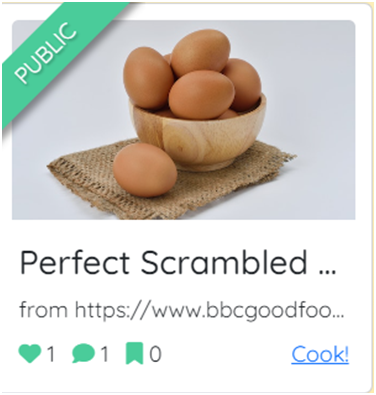

##### No results
- Other options suggested if no results found

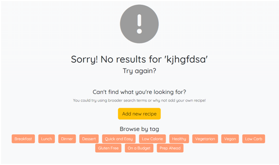

#### Recipe
- Recipe image, title, author, created and modified dates and caption displayed in container at top.
- Edit and delete buttons present if viewed by owner. Like, save and notes available if viewed by someone else.
- Ingredients and steps displayed in their own containers below

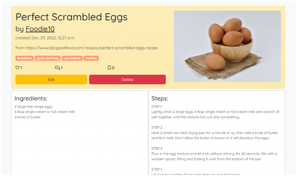

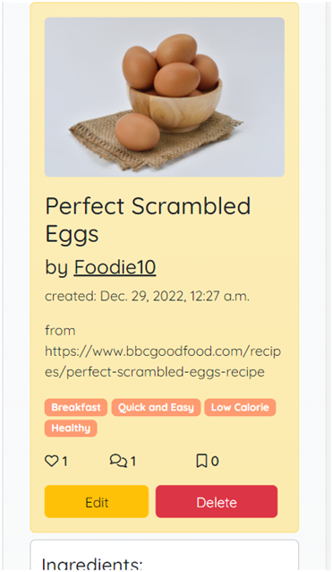

#### Add/Edit Recipe
- Crispy form
- Inputs: title, caption, image select, ingredients, steps, private checkbox, tags checkboxes

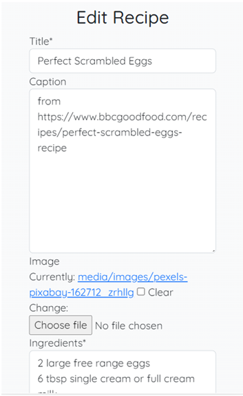

#### Profile
- Profile image, username, joined date, bio and count of public recipes displayed in container at top.
- Edit and notifications buttons present if viewed by owner. Toggle to switch between viewing saved and posted recipes also present when viewed by self.
- Only public posted recipes available if viewed by someone else

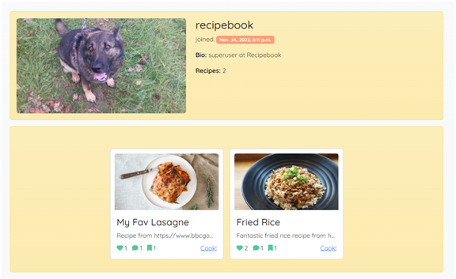

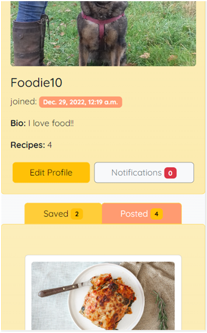

#### Edit Profile
- Crispy form
- Form is optional after registration so not inputs are required
- Inputs: first name, last name, image select, bio

### Technologies used

#### Languages
- [HTML](https://en.wikipedia.org/wiki/HTML)
- [CSS](https://en.wikipedia.org/wiki/CSS)
- [Git](https://en.wikipedia.org/wiki/Git) for version control
- [JavaScript](https://en.wikipedia.org/wiki/JavaScript)
- [Python](https://en.wikipedia.org/wiki/Python_(programming_language))

#### Imported modules
- [os](https://docs.python.org/3/library/os.html)

#### Installed Libraries
- [cloudinary](https://pypi.org/project/cloudinary/)
- [dj3-cloudinary-storage](https://pypi.org/project/dj3-cloudinary-storage/)
- [gunicorn](https://pypi.org/project/gunicorn/)
- [oauthlib](https://pypi.org/project/oauthlib/)
- [psycopg2](https://pypi.org/project/psycopg2/)
- [whitenoise](https://pypi.org/project/whitenoise/)
- [django-crispy-forms](https://pypi.org/project/django-crispy-forms/)

#### Frameworks
- [Django](https://www.djangoproject.com/)

#### Other resources
- [Gitpod](https://www.gitpod.io/) to alter and manage website files
- [Github](https://github.com/) to create and store website files
- [Heroku](https://dashboard.heroku.com/apps) to deploy web application
- [Chrome Devtools](https://developer.chrome.com/docs/devtools/) to test site throughout process
- [Balsamiq](https://balsamiq.com/) to create wireframes
- [Coolors](https://coolors.co/) to choose a colour scheme
- [Bootstrap](https://getbootstrap.com/docs/5.0/getting-started/introduction/) to help with styling and responsive design
- [Cloudinary](https://cloudinary.com/) for database and staic file storage
- [Google Fonts](https://fonts.google.com/) for the website font (Cabin)
- [Font Awesome](https://fontawesome.com/) used to add icons
- [Pexels](https://www.pexels.com/) for submitted recipe examples
- [Favicon.io](https://favicon.io/favicon-generator/) used to create favicon
- [Code Institute](https://codeinstitute.net/) fullstack developer course to provide learning materials
- [W3Schools](https://www.w3schools.com/) for help with common coding issues
- [Geeks For Geeks](https://www.geeksforgeeks.org/)  for help with common coding issues
- [Stack Overflow](https://stackoverflow.com/) for help with common coding issues
- [Am I Responsive?](https://ui.dev/amiresponsive) for device simulations

---
## Surface

### Design

#### Colour scheme

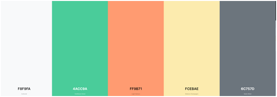

- The colour-scheme is vibrant but soft to provide a pleasing display and compliment any recipe images displayed on the site. The tone of the colours were chosen to compliment the bootstrap *light* and *secondary* classes as ashown above.
- Bootstrap border and background colours were used on secondary features. Bootstrap button colours also used.
- I used [Coolors](https://coolors.co/) to help pick a colour scheme.

#### Imagery
- Images are uploaded by the users and stored in Cloudinary database.
- There are placeholder images for both recipes and profiles if image field empty
- Example recipes uploaded with images from Pexels

#### Typography
- All text is in the Quicksand font. It is a display sans serif with rounded terminals. It is designed for display purposes but kept legible enough to use in small sizes as well[*](https://fonts.google.com/specimen/Quicksand/about?query=quicksand). It pairs well with the softer colours and rounded corners of the design.
- Sans serif has been used as the fallback option since it is the closest web-safe font.

#### Icons
- [Font Awesome](https://fontawesome.com/) icons were used for navigation buttons as well as in creation of the placeholder images.

### Deployment
- This site was developed using [Gitpod](https://www.gitpod.io/), stored on [Github](https://github.com/) and deployed with [Heroku](https://dashboard.heroku.com/apps).

- Testing on Gitpod:
    1. In the terminal, type "python3 manage.py runserver" and press enter to begin the application
    2. Click "Open in Browser" on the pop-up
    3. Once finished, use Ctrl + C in the terminal to close the application

- Deploying on Heroku:
    1. From the homescreen, click "New" and select "Create new app"
    2. Choose app name, select region and click "Create"
    3. Go to "Settings" and add PORT : 8000 to the Config Vars (CLOUDINARY_URL : {cloudinary url}, DATABASE_URL: {postgres url}, SECRET_KEY: {django secure key} also added but excluded from Github for security reasons)
    4. Add heroku/python buildpack
    5. Go to "Deploy" and connect Github repository
    6. Select "Enable Automatic Deploys" and click "Deploy Branch"

---
## Credits

### Content
- Websites used for initial research:
  - [Facebook](https://www.facebook.com/) for social features
  - [Jamie Oliver](https://www.jamieoliver.com/) for design inspiration
  - [BBC GoodFood](https://www.bbcgoodfood.com/) for recipe presentation
- Code for ordering by count of ManyToMany field (used when browsing by popularity) from [https://stackoverflow.com/questions/28254142/django-order-by-count-of-many-to-many-object](https://stackoverflow.com/questions/28254142/django-order-by-count-of-many-to-many-object)
- Retrieving search term from search bar to display matches from [https://www.youtube.com/watch?v=AGtae4L5BbI](https://www.youtube.com/watch?v=AGtae4L5BbI)
- Custom error pages from tutorial at [https://www.geeksforgeeks.org/django-creating-a-404-error-page/](https://www.geeksforgeeks.org/django-creating-a-404-error-page/)
- Signals tutorial and code to connect Profile database to User inspired by [https://www.youtube.com/watch?v=Kc1Q_ayAeQk](https://www.youtube.com/watch?v=Kc1Q_ayAeQk)
- Recipe card banner to show private/public recipes provided by [https://codepen.io/alexerlandsson/pen/NqXWwX](https://codepen.io/alexerlandsson/pen/NqXWwX)
- Idea for TAGS list -> tuple for better code consistency and less error-prone tags provided by Reuben Ferrante (CI Mentor)
- Saving new slug when updating a recipe at [https://stackoverflow.com/questions/33176569/slugfield-in-django-and-overriding-save](https://stackoverflow.com/questions/33176569/slugfield-in-django-and-overriding-save)
- Lking posts as well as counting likes and saves inspired by [Code Institute](https://codeinstitute.net/) 'I Think Therefore I Blog' walkthrough project.
- Code for multiple forms in one template from [https://openclassrooms.com/en/courses/7107341-intermediate-django/7264795-include-multiple-forms-on-a-page](https://openclassrooms.com/en/courses/7107341-intermediate-django/7264795-include-multiple-forms-on-a-page)
- Formatting textarea widget from [https://stackoverflow.com/questions/6536373/how-can-i-set-the-size-of-rows-columns-in-textfield-in-django-models](https://stackoverflow.com/questions/6536373/how-can-i-set-the-size-of-rows-columns-in-textfield-in-django-models)
- How to return to same page from [https://stackoverflow.com/questions/50006147/how-to-return-redirect-to-previous-page-in-django-after-post-request](https://stackoverflow.com/questions/50006147/how-to-return-redirect-to-previous-page-in-django-after-post-request)
- Idea for holding temporary data and cleaning before saving from [https://www.geeksforgeeks.org/multiplechoicefield-django-forms/](https://www.geeksforgeeks.org/multiplechoicefield-django-forms/)
- Prepopulating form after failed attempt from [https://www.reddit.com/r/django/comments/4oie1d/how_to_automatically_prepopulate_data_in_forms/](https://www.reddit.com/r/django/comments/4oie1d/how_to_automatically_prepopulate_data_in_forms/) and [https://docs.djangoproject.com/en/dev/ref/forms/api/#dynamic-initial-values](https://docs.djangoproject.com/en/dev/ref/forms/api/#dynamic-initial-values)
- Fixing mime-type bug in settings file from [https://stackoverflow.com/questions/35557129/css-not-loading-wrong-mime-type-django](https://stackoverflow.com/questions/35557129/css-not-loading-wrong-mime-type-django)

### Media
- All icons from [Font Awesome](https://fontawesome.com/)
- All uploaded images from [Pexels](https://www.pexels.com/)

### Acknowledgements
- [Code Institute](https://codeinstitute.net/) for providing excellent learning content
- Reuben Ferrante as my mentor and providing vital feedback throughout the project's development
- [W3Schools](https://www.w3schools.com/) for quick and easy tutorials on programming languages
- [Geeks For Geeks](https://www.geeksforgeeks.org/) for quick and easy tutorials on programming languages
- The users of [Stack Overflow](https://stackoverflow.com/) for asking and answering some of the harder Django questions
- Other CI students for sharing their work and providing inspiration and guidance through the Slack channels

---

Becky Skelcher 2022